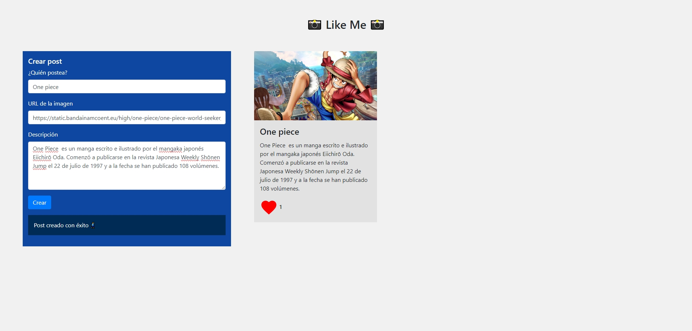

# Desafío Guiado - Like Me

En este desafío, se valida el conocimiento en consultas con texto parametrizado, manejo de JSON, inserción, consulta y actualización de registros en una base de datos PostgreSQL. El objetivo es crear un servidor que permita gestionar posts y likes para una red social ficticia llamada "Like Me".

## Descripción

La red social "Like Me" está en desarrollo y requiere una lógica básica para manejar posts y likes. El desafío consiste en construir un servidor utilizando Node.js y PostgreSQL que permita:

1. Crear nuevos posts.
2. Actualizar el número de likes de un post específico.
3. Consultar todos los posts existentes en la base de datos.

## Vista del Diseño

El proyecto incluye una interfaz HTML proporcionada para la interacción con el servidor.

## Requerimientos

1. **Ruta POST `/post`**
   - Implementa una función asíncrona para insertar un nuevo post en la base de datos `posts`.
   - Utiliza una consulta SQL parametrizada para almacenar la información del post.

2. **Ruta PUT `/post`**
   - Implementa una función asíncrona para actualizar el número de likes de un post.
   - El post se identifica por su `id`, que se debe enviar como query string.

3. **Ruta GET `/posts`**
   - Implementa una función asíncrona para recuperar todos los posts de la base de datos `posts`.

## Tecnologías Utilizadas

- **Node.js**: Para construir el servidor.
- **PostgreSQL**: Para gestionar la base de datos.
- **pg**: Paquete Node.js para interactuar con PostgreSQL.
- **Express**: Framework para simplificar la creación del servidor.

## Autor

Este proyecto fue desarrollado por **Valeria Torrealba**.

